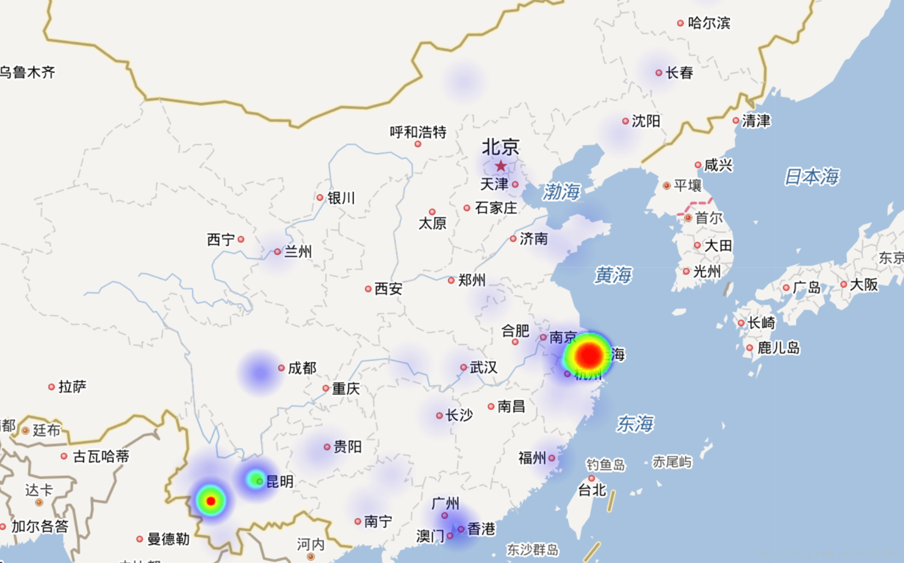
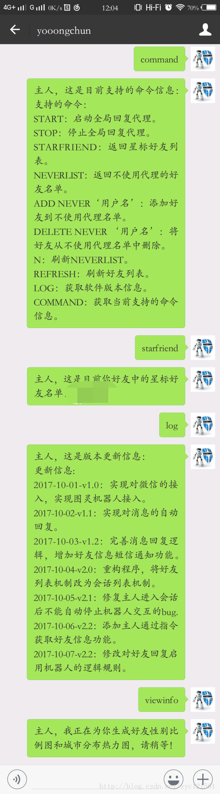

Python实现微信小助手

---

摘要：该程序实现接入个人微信号并实现自动回复的功能，同时可选择好友有消息时短信通知或者邮件通知你。接入微信号使用了作者：$LittleCoder$ 的$itchat$ 微信接口开源库，在此感谢该作者！

作者：yooongchun

微信公众号：yooongchun小屋

---

**更新：亲们，一定要把以下信息替换为自己的啊，不然消息全都发到我这儿了，，，，，，**

**请注意：**
**1、发短信的号码等信息请替换为自己的信息，需要自己到相应网站申请号码和权限**
**2、发邮件的信息请替换为自己的信息**
**3、生成热力图需要的API key请替换为自己的信息**
**4、接入图灵器人的key请替换为自己的信息**

---

### 0.首先我们来看几张图：

- 好友性别信息统计结果：

  

  ---

- 好友城市分布信息统计：使用百度热力图实现

  

  ---

- 自己给文件助手发送命令及与机器人聊天

  

  ---

- 与好友的聊天接入机器人：

    

---

  

### 1.基本功能介绍：

- 收到好友消息时自动回复
- 收到特定好友消息时短信/邮件通知你
- 接入图灵机器人自动聊天（可启用对指定好友的机器人代理回复）
- 统计好友信息生成热力图，包括好友的性别比例、城市分布

### 2.基本使用说明：

- 接收的消息类型包括：文字、图片、视频、语音、共享、联系人名片、地图、声音文件

### 3.处理规则：

- 对于文字类消息，分为两类好友进行判别：

    - **非星标好友** ：收到该类好友第一条消息后会发送以下全局变量中的：`FirstMsg`，然后根据好友的回复来选择回复逻辑：
      - 如果好友回复内容是`ReceiveYes`中的内容之一，则会发邮件通知你，并给好友回复`ReplyYes`中的内容
      - 如果好友回复内容是`ReceiveNo`中的内容之一，则不会通知你，并且给好友回复`ReplyNo`中的内容
      - 否则调用图灵机器人，同时计时器开始计时会话周期，当计时器过了`CountTime`时间后没有收到该好友消息或者你也没有发送消息给给好友那么当前会话结束
    - 星标好友：与普通好友的区别在于好友第一条消息后会发送以下全局变量中的：`FirstMsg`，并且加送一条提示`VIPMsg` ，然后自动邮件通知你

    其余一致

- 对于非文字类消息：

    所有好友统一回复，说明接收到的文件类型，并说明小助手暂不支持处理该类消息  
### 4.会话类型

会话类型包括三类，一类是自己发给自己，用来测试，一类是自己发给别人，另一类是别人发给自己

- 对于自己发给自己的消息，使用`host_info`函数处理
- 对另外两类消息统一由`auto_reply` 函数代理

### 5.支持的命令信息

该命令需要在微信文件助手中发送，发送`command` 则会返回这些支持的命令，使用时发送对应的指令即可

    command = "支持的命令：\n" \
          "START：启动全局回复代理。\n" \
          "STOP：停止全局回复代理。\n" \
          "STARFRIEND：返回星标好友列表。\n" \
          "NEVERLIST：返回不使用代理的好友名单。\n" \
          "ADD NEVER‘用户名’：添加好友到不使用代理名单。\n" \
          "DELETE NEVER ‘用户名’：将好友从不使用代理名单中删除。\n" \
          "N：刷新NEVERLIST。\n" \
          "REFRESH：刷新好友列表。\n" \
          "LOG：获取软件版本信息。\n" \
          "COMMAND：获取当前支持的命令信息。\n"
### 6.代码结构说明

- 代码包含两部分，`AutoReply2.2.py` 是主文件，运行该文件即可运行主程序，`util.py` 是实现功能的模块，提供主程序需要的功能，如发送短信，发送邮件，生成热力图等等

### 7.项目代码下载地址

Github :https://github.com/yooongchun/Python_wechat

